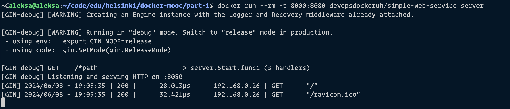

```
aleksa@aleksa:~/code/edu/helsinki/docker-mooc/part-1$ docker run --rm -p 8000:8080 devopsdockeruh/simple-web-service server
[GIN-debug] [WARNING] Creating an Engine instance with the Logger and Recovery middleware already attached.

[GIN-debug] [WARNING] Running in "debug" mode. Switch to "release" mode in production.
 - using env:   export GIN_MODE=release
 - using code:  gin.SetMode(gin.ReleaseMode)

[GIN-debug] GET    /*path                    --> server.Start.func1 (3 handlers)
[GIN-debug] Listening and serving HTTP on :8080
[GIN] 2024/06/08 - 19:07:08 | 200 |      26.991µs |    192.168.0.26 | GET      "/"
[GIN] 2024/06/08 - 19:07:08 | 200 |      15.129µs |    192.168.0.26 | GET      "/favicon.ico"
```

