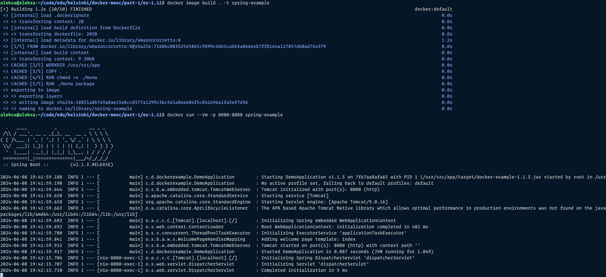

```
aleksa@aleksa:~/code/edu/helsinki/docker-mooc/part-1/ex-1.11$ docker image build . -t spring-example
[+] Building 1.2s (10/10) FINISHED                                                                                                                        docker:default
 => [internal] load .dockerignore                                                                                                                                   0.0s
 => => transferring context: 2B                                                                                                                                     0.0s
 => [internal] load build definition from Dockerfile                                                                                                                0.0s
 => => transferring dockerfile: 205B                                                                                                                                0.0s
 => [internal] load metadata for docker.io/library/amazoncorretto:8                                                                                                 1.2s
 => [1/5] FROM docker.io/library/amazoncorretto:8@sha256:7188bc083325e5865c9899c4bb5cabb3a866eeb7ff8164a127857d60ad744379                                           0.0s
 => [internal] load build context                                                                                                                                   0.0s
 => => transferring context: 9.30kB                                                                                                                                 0.0s
 => CACHED [2/5] WORKDIR /usr/src/app                                                                                                                               0.0s
 => CACHED [3/5] COPY . .                                                                                                                                           0.0s
 => CACHED [4/5] RUN chmod +x ./mvnw                                                                                                                                0.0s
 => CACHED [5/5] RUN ./mvnw package                                                                                                                                 0.0s
 => exporting to image                                                                                                                                              0.0s
 => => exporting layers                                                                                                                                             0.0s
 => => writing image sha256:18831a8b7e9a8ae15e8cc0377a1299c36c5e1a8ee684f5c842e96a1fa5ef7d96                                                                        0.0s
 => => naming to docker.io/library/spring-example                                                                                                                   0.0s
aleksa@aleksa:~/code/edu/helsinki/docker-mooc/part-1/ex-1.11$ docker run --rm -p 8080:8080 spring-example

  .   ____          _            __ _ _
 /\\ / ___'_ __ _ _(_)_ __  __ _ \ \ \ \
( ( )\___ | '_ | '_| | '_ \/ _` | \ \ \ \
 \\/  ___)| |_)| | | | | || (_| |  ) ) ) )
  '  |____| .__|_| |_|_| |_\__, | / / / /
 =========|_|==============|___/=/_/_/_/
 :: Spring Boot ::        (v2.1.3.RELEASE)

2024-06-08 19:41:59.188  INFO 1 --- [           main] c.d.dockerexample.DemoApplication        : Starting DemoApplication v1.1.3 on 7f67aa8afa65 with PID 1 (/usr/src/app/target/docker-example-1.1.3.jar started by root in /usr/src/app)
2024-06-08 19:41:59.190  INFO 1 --- [           main] c.d.dockerexample.DemoApplication        : No active profile set, falling back to default profiles: default
2024-06-08 19:41:59.644  INFO 1 --- [           main] o.s.b.w.embedded.tomcat.TomcatWebServer  : Tomcat initialized with port(s): 8080 (http)
2024-06-08 19:41:59.658  INFO 1 --- [           main] o.apache.catalina.core.StandardService   : Starting service [Tomcat]
2024-06-08 19:41:59.658  INFO 1 --- [           main] org.apache.catalina.core.StandardEngine  : Starting Servlet engine: [Apache Tomcat/9.0.16]
2024-06-08 19:41:59.663  INFO 1 --- [           main] o.a.catalina.core.AprLifecycleListener   : The APR based Apache Tomcat Native library which allows optimal performance in production environments was not found on the java.library.path: [/usr/java/packages/lib/amd64:/usr/lib64:/lib64:/lib:/usr/lib]
2024-06-08 19:41:59.692  INFO 1 --- [           main] o.a.c.c.C.[Tomcat].[localhost].[/]       : Initializing Spring embedded WebApplicationContext
2024-06-08 19:41:59.692  INFO 1 --- [           main] o.s.web.context.ContextLoader            : Root WebApplicationContext: initialization completed in 482 ms
2024-06-08 19:41:59.780  INFO 1 --- [           main] o.s.s.concurrent.ThreadPoolTaskExecutor  : Initializing ExecutorService 'applicationTaskExecutor'
2024-06-08 19:41:59.841  INFO 1 --- [           main] o.s.b.a.w.s.WelcomePageHandlerMapping    : Adding welcome page template: index
2024-06-08 19:41:59.915  INFO 1 --- [           main] o.s.b.w.embedded.tomcat.TomcatWebServer  : Tomcat started on port(s): 8080 (http) with context path ''
2024-06-08 19:41:59.917  INFO 1 --- [           main] c.d.dockerexample.DemoApplication        : Started DemoApplication in 0.887 seconds (JVM running for 1.049)
2024-06-08 19:42:15.706  INFO 1 --- [nio-8080-exec-1] o.a.c.c.C.[Tomcat].[localhost].[/]       : Initializing Spring DispatcherServlet 'dispatcherServlet'
2024-06-08 19:42:15.707  INFO 1 --- [nio-8080-exec-1] o.s.web.servlet.DispatcherServlet        : Initializing Servlet 'dispatcherServlet'
2024-06-08 19:42:15.710  INFO 1 --- [nio-8080-exec-1] o.s.web.servlet.DispatcherServlet        : Completed initialization in 3 ms
^C2024-06-08 19:43:39.260  INFO 1 --- [       Thread-3] o.s.s.concurrent.ThreadPoolTaskExecutor  : Shutting down ExecutorService 'applicationTaskExecutor'
```


