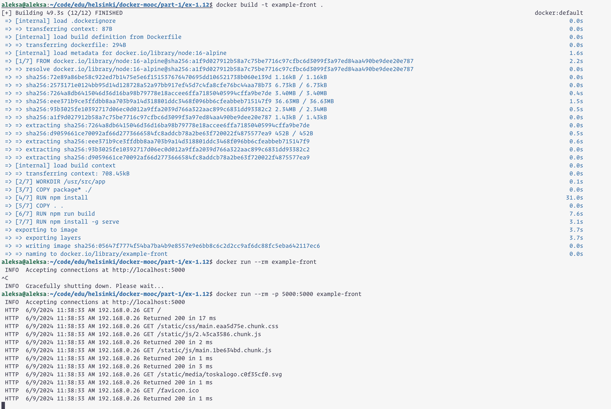

```
aleksa@aleksa:~/code/edu/helsinki/docker-mooc/part-1/ex-1.12$ docker build -t example-front .
[+] Building 49.3s (12/12) FINISHED                                                                                                                       docker:default
 => [internal] load .dockerignore                                                                                                                                   0.0s
 => => transferring context: 87B                                                                                                                                    0.0s
 => [internal] load build definition from Dockerfile                                                                                                                0.0s
 => => transferring dockerfile: 294B                                                                                                                                0.0s
 => [internal] load metadata for docker.io/library/node:16-alpine                                                                                                   1.6s
 => [1/7] FROM docker.io/library/node:16-alpine@sha256:a1f9d027912b58a7c75be7716c97cfbc6d3099f3a97ed84aa490be9dee20e787                                             2.2s
 => => resolve docker.io/library/node:16-alpine@sha256:a1f9d027912b58a7c75be7716c97cfbc6d3099f3a97ed84aa490be9dee20e787                                             0.0s
 => => sha256:72e89a86be58c922ed7b1475e5e6f151537676470695dd106521738b060e139d 1.16kB / 1.16kB                                                                      0.0s
 => => sha256:2573171e0124bb95d14d128728a52a97bb917ef45d7c4fa8cfe76bc44aa78b73 6.73kB / 6.73kB                                                                      0.0s
 => => sha256:7264a8db6415046d36d16ba98b79778e18accee6ffa71850405994cffa9be7de 3.40MB / 3.40MB                                                                      0.4s
 => => sha256:eee371b9ce3ffdbb8aa703b9a14d318801ddc3468f096bb6cfeabbeb715147f9 36.63MB / 36.63MB                                                                    1.5s
 => => sha256:93b3025fe10392717d06ec0d012a9ffa2039d766a322aac899c6831dd93382c2 2.34MB / 2.34MB                                                                      0.5s
 => => sha256:a1f9d027912b58a7c75be7716c97cfbc6d3099f3a97ed84aa490be9dee20e787 1.43kB / 1.43kB                                                                      0.0s
 => => extracting sha256:7264a8db6415046d36d16ba98b79778e18accee6ffa71850405994cffa9be7de                                                                           0.0s
 => => sha256:d9059661ce70092af66d2773666584fc8addcb78a2be63f720022f4875577ea9 452B / 452B                                                                          0.5s
 => => extracting sha256:eee371b9ce3ffdbb8aa703b9a14d318801ddc3468f096bb6cfeabbeb715147f9                                                                           0.6s
 => => extracting sha256:93b3025fe10392717d06ec0d012a9ffa2039d766a322aac899c6831dd93382c2                                                                           0.0s
 => => extracting sha256:d9059661ce70092af66d2773666584fc8addcb78a2be63f720022f4875577ea9                                                                           0.0s
 => [internal] load build context                                                                                                                                   0.0s
 => => transferring context: 708.45kB                                                                                                                               0.0s
 => [2/7] WORKDIR /usr/src/app                                                                                                                                      0.1s
 => [3/7] COPY package* ./                                                                                                                                          0.0s
 => [4/7] RUN npm install                                                                                                                                          31.0s
 => [5/7] COPY . .                                                                                                                                                  0.0s
 => [6/7] RUN npm run build                                                                                                                                         7.6s
 => [7/7] RUN npm install -g serve                                                                                                                                  3.1s
 => exporting to image                                                                                                                                              3.7s
 => => exporting layers                                                                                                                                             3.7s
 => => writing image sha256:05647f7774f54ba7ba4b9e8557e9e6bb8c6c2d2cc9af6dc88fc5eba642117ec6                                                                        0.0s
 => => naming to docker.io/library/example-front                                                                                                                    0.0s

aleksa@aleksa:~/code/edu/helsinki/docker-mooc/part-1/ex-1.12$ docker run --rm -p 5000:5000 example-front
 INFO  Accepting connections at http://localhost:5000
 HTTP  6/9/2024 11:38:33 AM 192.168.0.26 GET /
 HTTP  6/9/2024 11:38:33 AM 192.168.0.26 Returned 200 in 17 ms
 HTTP  6/9/2024 11:38:33 AM 192.168.0.26 GET /static/css/main.eaa5d75e.chunk.css
 HTTP  6/9/2024 11:38:33 AM 192.168.0.26 GET /static/js/2.43ca3586.chunk.js
 HTTP  6/9/2024 11:38:33 AM 192.168.0.26 Returned 200 in 2 ms
 HTTP  6/9/2024 11:38:33 AM 192.168.0.26 GET /static/js/main.1be634bd.chunk.js
 HTTP  6/9/2024 11:38:33 AM 192.168.0.26 Returned 200 in 1 ms
 HTTP  6/9/2024 11:38:33 AM 192.168.0.26 Returned 200 in 3 ms
 HTTP  6/9/2024 11:38:33 AM 192.168.0.26 GET /static/media/toskalogo.c0f35cf0.svg
 HTTP  6/9/2024 11:38:33 AM 192.168.0.26 Returned 200 in 1 ms
 HTTP  6/9/2024 11:38:33 AM 192.168.0.26 GET /favicon.ico
 HTTP  6/9/2024 11:38:33 AM 192.168.0.26 Returned 200 in 1 ms
^C
 INFO  Gracefully shutting down. Please wait...
```


