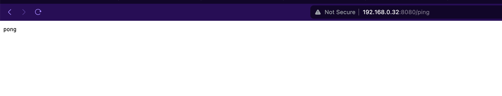
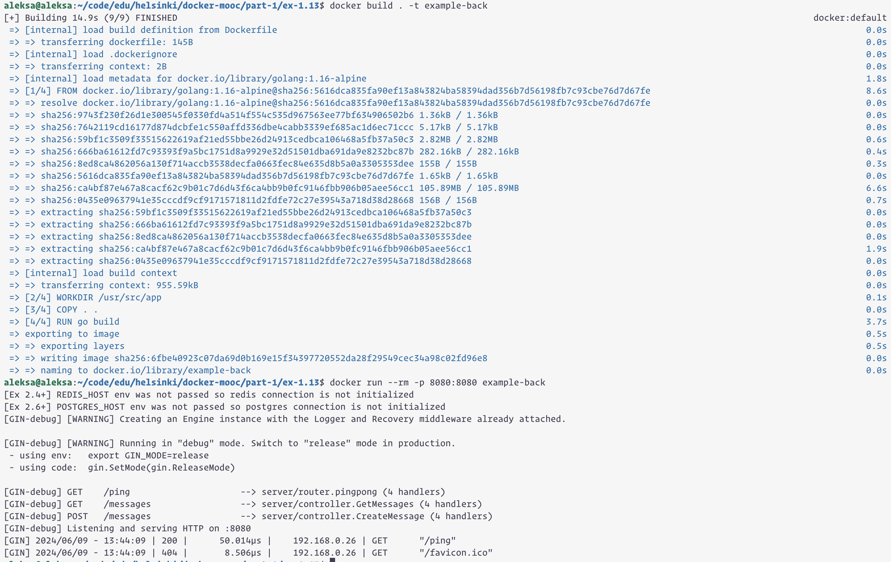

```
aleksa@aleksa:~/code/edu/helsinki/docker-mooc/part-1/ex-1.13$ docker build . -t example-back
[+] Building 14.9s (9/9) FINISHED                                                                                                                         docker:default
 => [internal] load build definition from Dockerfile                                                                                                                0.0s
 => => transferring dockerfile: 145B                                                                                                                                0.0s
 => [internal] load .dockerignore                                                                                                                                   0.0s
 => => transferring context: 2B                                                                                                                                     0.0s
 => [internal] load metadata for docker.io/library/golang:1.16-alpine                                                                                               1.8s
 => [1/4] FROM docker.io/library/golang:1.16-alpine@sha256:5616dca835fa90ef13a843824ba58394dad356b7d56198fb7c93cbe76d7d67fe                                         8.6s
 => => resolve docker.io/library/golang:1.16-alpine@sha256:5616dca835fa90ef13a843824ba58394dad356b7d56198fb7c93cbe76d7d67fe                                         0.0s
 => => sha256:9743f230f26d1e300545f0330fd4a514f554c535d967563ee77bf634906502b6 1.36kB / 1.36kB                                                                      0.0s
 => => sha256:7642119cd16177d874dcbfe1c550affd336dbe4cabb3339ef685ac1d6ec71ccc 5.17kB / 5.17kB                                                                      0.0s
 => => sha256:59bf1c3509f33515622619af21ed55bbe26d24913cedbca106468a5fb37a50c3 2.82MB / 2.82MB                                                                      0.6s
 => => sha256:666ba61612fd7c93393f9a5bc1751d8a9929e32d51501dba691da9e8232bc87b 282.16kB / 282.16kB                                                                  0.4s
 => => sha256:8ed8ca4862056a130f714accb3538decfa0663fec84e635d8b5a0a3305353dee 155B / 155B                                                                          0.3s
 => => sha256:5616dca835fa90ef13a843824ba58394dad356b7d56198fb7c93cbe76d7d67fe 1.65kB / 1.65kB                                                                      0.0s
 => => sha256:ca4bf87e467a8cacf62c9b01c7d6d43f6ca4bb9b0fc9146fbb906b05aee56cc1 105.89MB / 105.89MB                                                                  6.6s
 => => sha256:0435e09637941e35cccdf9cf9171571811d2fdfe72c27e39543a718d38d28668 156B / 156B                                                                          0.7s
 => => extracting sha256:59bf1c3509f33515622619af21ed55bbe26d24913cedbca106468a5fb37a50c3                                                                           0.0s
 => => extracting sha256:666ba61612fd7c93393f9a5bc1751d8a9929e32d51501dba691da9e8232bc87b                                                                           0.0s
 => => extracting sha256:8ed8ca4862056a130f714accb3538decfa0663fec84e635d8b5a0a3305353dee                                                                           0.0s
 => => extracting sha256:ca4bf87e467a8cacf62c9b01c7d6d43f6ca4bb9b0fc9146fbb906b05aee56cc1                                                                           1.9s
 => => extracting sha256:0435e09637941e35cccdf9cf9171571811d2fdfe72c27e39543a718d38d28668                                                                           0.0s
 => [internal] load build context                                                                                                                                   0.0s
 => => transferring context: 955.59kB                                                                                                                               0.0s
 => [2/4] WORKDIR /usr/src/app                                                                                                                                      0.1s
 => [3/4] COPY . .                                                                                                                                                  0.0s
 => [4/4] RUN go build                                                                                                                                              3.7s
 => exporting to image                                                                                                                                              0.5s
 => => exporting layers                                                                                                                                             0.5s
 => => writing image sha256:6fbe40923c07da69d0b169e15f34397720552da28f29549cec34a98c02fd96e8                                                                        0.0s 
 => => naming to docker.io/library/example-back                                                                                                                     0.0s 
aleksa@aleksa:~/code/edu/helsinki/docker-mooc/part-1/ex-1.13$ docker run --rm -p 8080:8080 example-back                                                                  
[Ex 2.4+] REDIS_HOST env was not passed so redis connection is not initialized                                                                                           
[Ex 2.6+] POSTGRES_HOST env was not passed so postgres connection is not initialized
[GIN-debug] [WARNING] Creating an Engine instance with the Logger and Recovery middleware already attached.

[GIN-debug] [WARNING] Running in "debug" mode. Switch to "release" mode in production.
 - using env:   export GIN_MODE=release
 - using code:  gin.SetMode(gin.ReleaseMode)

[GIN-debug] GET    /ping                     --> server/router.pingpong (4 handlers)
[GIN-debug] GET    /messages                 --> server/controller.GetMessages (4 handlers)
[GIN-debug] POST   /messages                 --> server/controller.CreateMessage (4 handlers)
[GIN-debug] Listening and serving HTTP on :8080
[GIN] 2024/06/09 - 13:44:09 | 200 |      50.014µs |    192.168.0.26 | GET      "/ping"
[GIN] 2024/06/09 - 13:44:09 | 404 |       8.506µs |    192.168.0.26 | GET      "/favicon.ico"
```


