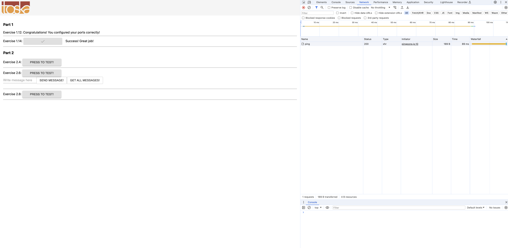
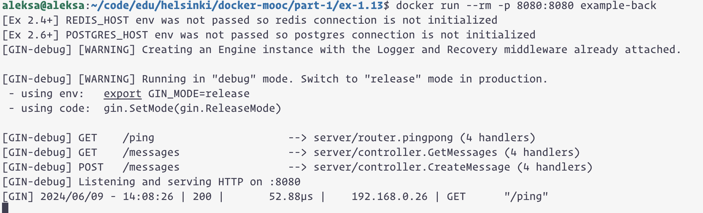
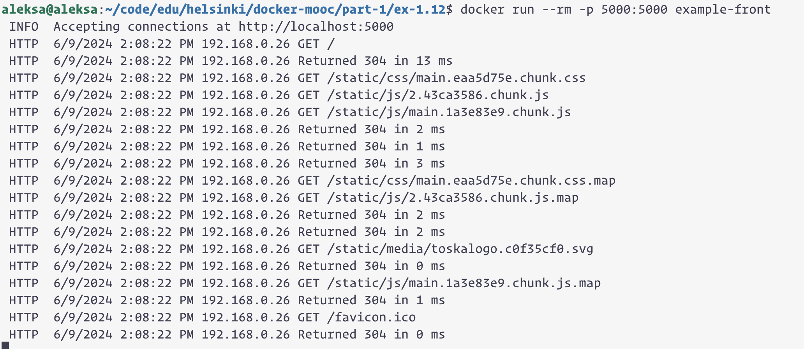

Terminal 1
```
aleksa@aleksa:~/code/edu/helsinki/docker-mooc/part-1/ex-1.12$ docker run --rm -p 5000:5000 example-front
 INFO  Accepting connections at http://localhost:5000
 HTTP  6/9/2024 2:08:22 PM 192.168.0.26 GET /
 HTTP  6/9/2024 2:08:22 PM 192.168.0.26 Returned 304 in 13 ms
 HTTP  6/9/2024 2:08:22 PM 192.168.0.26 GET /static/css/main.eaa5d75e.chunk.css
 HTTP  6/9/2024 2:08:22 PM 192.168.0.26 GET /static/js/2.43ca3586.chunk.js
 HTTP  6/9/2024 2:08:22 PM 192.168.0.26 GET /static/js/main.1a3e83e9.chunk.js
 HTTP  6/9/2024 2:08:22 PM 192.168.0.26 Returned 304 in 2 ms
 HTTP  6/9/2024 2:08:22 PM 192.168.0.26 Returned 304 in 1 ms
 HTTP  6/9/2024 2:08:22 PM 192.168.0.26 Returned 304 in 3 ms
 HTTP  6/9/2024 2:08:22 PM 192.168.0.26 GET /static/css/main.eaa5d75e.chunk.css.map
 HTTP  6/9/2024 2:08:22 PM 192.168.0.26 GET /static/js/2.43ca3586.chunk.js.map
 HTTP  6/9/2024 2:08:22 PM 192.168.0.26 Returned 304 in 2 ms
 HTTP  6/9/2024 2:08:22 PM 192.168.0.26 Returned 304 in 2 ms
 HTTP  6/9/2024 2:08:22 PM 192.168.0.26 GET /static/media/toskalogo.c0f35cf0.svg
 HTTP  6/9/2024 2:08:22 PM 192.168.0.26 Returned 304 in 0 ms
 HTTP  6/9/2024 2:08:22 PM 192.168.0.26 GET /static/js/main.1a3e83e9.chunk.js.map
 HTTP  6/9/2024 2:08:22 PM 192.168.0.26 Returned 304 in 1 ms
 HTTP  6/9/2024 2:08:22 PM 192.168.0.26 GET /favicon.ico
 HTTP  6/9/2024 2:08:22 PM 192.168.0.26 Returned 304 in 0 ms
```
Terminal 2
```
 aleksa@aleksa:~/code/edu/helsinki/docker-mooc/part-1/ex-1.13$ docker run --rm -p 8080:8080 example-back
[Ex 2.4+] REDIS_HOST env was not passed so redis connection is not initialized
[Ex 2.6+] POSTGRES_HOST env was not passed so postgres connection is not initialized
[GIN-debug] [WARNING] Creating an Engine instance with the Logger and Recovery middleware already attached.
[GIN-debug] [WARNING] Running in "debug" mode. Switch to "release" mode in production.
 - using env:   export GIN_MODE=release
 - using code:  gin.SetMode(gin.ReleaseMode)

[GIN-debug] GET    /ping                     --> server/router.pingpong (4 handlers)
[GIN-debug] GET    /messages                 --> server/controller.GetMessages (4 handlers)
[GIN-debug] POST   /messages                 --> server/controller.CreateMessage (4 handlers)
[GIN-debug] Listening and serving HTTP on :8080
[GIN] 2024/06/09 - 14:08:26 | 200 |       52.88µs |    192.168.0.26 | GET      "/ping"
```



