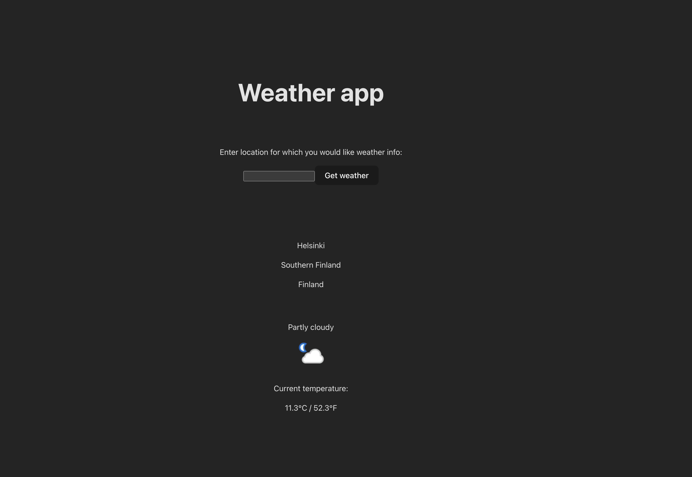
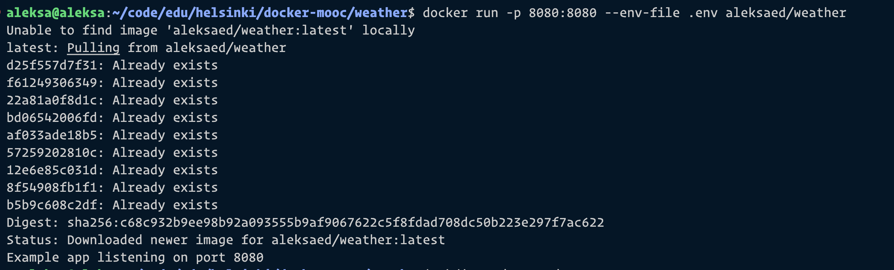

Hosted at [https://hub.docker.com/r/aleksaed/weather](https://hub.docker.com/r/aleksaed/weather)

```
aleksa@aleksa:~/code/edu/helsinki/docker-mooc/weather$ docker build . -t aleksaed/weather
[+] Building 1.9s (11/11) FINISHED                                                                                            docker:default
 => [internal] load build definition from Dockerfile                                                                                    0.0s
 => => transferring dockerfile: 251B                                                                                                    0.0s
 => [internal] load .dockerignore                                                                                                       0.0s
 => => transferring context: 167B                                                                                                       0.0s
 => [internal] load metadata for docker.io/library/node:18-alpine                                                                       1.0s
 => [1/6] FROM docker.io/library/node:18-alpine@sha256:6937be95129321422103452e2883021cc4a96b63c32d7947187fcb25df84fc3f                 0.0s
 => [internal] load build context                                                                                                       0.0s
 => => transferring context: 1.77kB                                                                                                     0.0s
 => CACHED [2/6] WORKDIR /usr/src/app                                                                                                   0.0s
 => CACHED [3/6] COPY package* ./                                                                                                       0.0s
 => CACHED [4/6] RUN npm install                                                                                                        0.0s
 => [5/6] COPY . .                                                                                                                      0.0s
 => [6/6] RUN npm run build                                                                                                             0.9s
 => exporting to image                                                                                                                  0.0s
 => => exporting layers                                                                                                                 0.0s
 => => writing image sha256:e59a7b2806b6b8a09518f6f99f6ecd0c168fff2ee1005439d180ee595936395c                                            0.0s
 => => naming to docker.io/aleksaed/weather                                                                                             0.0s
aleksa@aleksa:~/code/edu/helsinki/docker-mooc/weather$ docker run --rm -p 8080:8080 --env-file .env aleksaed/weather                         
Example app listening on port 8080
```


## React + Node + weatherapi.com

Required steps:

1. Create an account at weatherapi.com to get API key
2. Set API key inside .env as VITE_API_KEY

Optional steps:

1. Set PORT inside .env for Node (defaults to 8080)

## Running container

`docker run -p 8080:8080 --env-file .env aleksaed/weather`

## Description

This project uses React in combination with Vite to handle UI and state for users. Users can type the location for which they would like to receive current weather information. Node in combination with Express is used to serve static files built by Vite.



