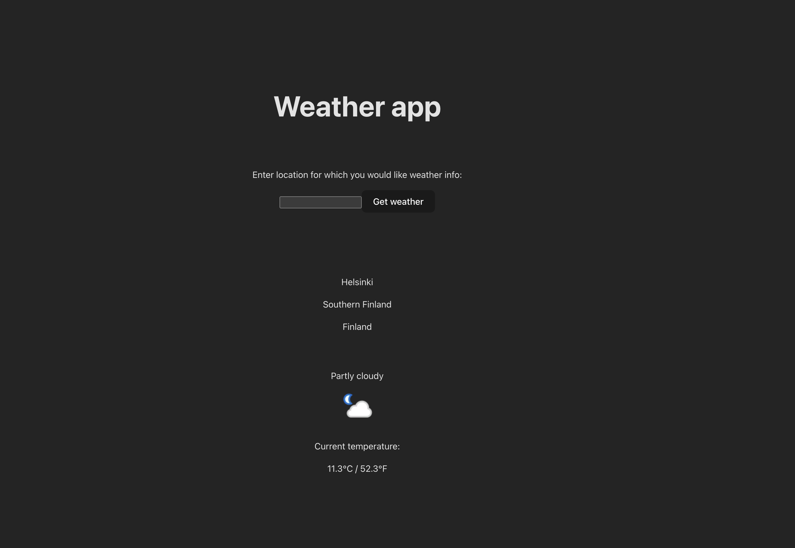

Hosted live with railway.app at [https://weather-production-7ddb.up.railway.app/](https://weather-production-7ddb.up.railway.app/)

Source code at [https://github.com/aleksa-ed/weather](https://github.com/aleksa-ed/weather)

## Description

This project uses React in combination with Vite to handle UI and state for users. Users can type the location for which they would like to receive current weather information. Node in combination with Express is used to serve static files built by Vite.

