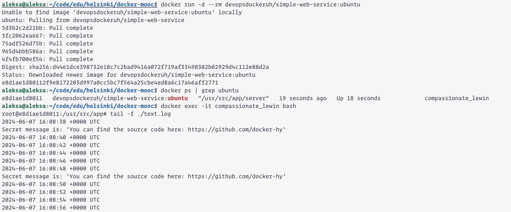

# Secret message is: 'You can find the source code here: https://github.com/docker-hy'


```
aleksa@aleksa:~/code/edu/helsinki/docker-mooc$ docker run -d --rm devopsdockeruh/simple-web-service:ubuntu
Unable to find image 'devopsdockeruh/simple-web-service:ubuntu' locally
ubuntu: Pulling from devopsdockeruh/simple-web-service
5d3b2c2d21bb: Pull complete 
3fc2062ea667: Pull complete 
75adf526d75b: Pull complete 
965d4bbb586a: Pull complete 
4f4fb700ef54: Pull complete 
Digest: sha256:d44e1dce398732e18c7c2bad9416a072f719af33498302b02929d4c112e88d2a
Status: Downloaded newer image for devopsdockeruh/simple-web-service:ubuntu
e8d1ae1d80112f9e8172203d997a0cc5bc7f564a25cbe4ed8a6c17a46aff2771
aleksa@aleksa:~/code/edu/helsinki/docker-mooc$ docker ps | grep ubuntu
e8d1ae1d8011   devopsdockeruh/simple-web-service:ubuntu   "/usr/src/app/server"   19 seconds ago   Up 18 seconds             compassionate_lewin
aleksa@aleksa:~/code/edu/helsinki/docker-mooc$ docker exec -it compassionate_lewin bash
root@e8d1ae1d8011:/usr/src/app# tail -f ./text.log 
2024-06-07 16:08:38 +0000 UTC
Secret message is: 'You can find the source code here: https://github.com/docker-hy'
2024-06-07 16:08:40 +0000 UTC
```

