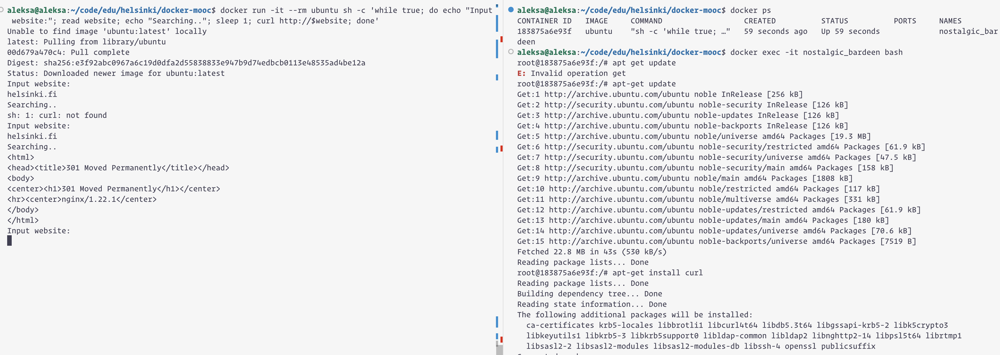

```
aleksa@aleksa:~/code/edu/helsinki/docker-mooc$ docker run -it --rm ubuntu sh -c 'while true; do echo "Input website:"; read website; echo "Searching.."; sleep 1; curl http://$website; done'
helsinki.fi
Searching..
sh: 1: curl: not found
Input website:
```

In another terminal I attached to the running container and used apt commands to install curl. My guess is that a smarter solution is to modify ubuntu image to have curl installed before running containers. We haven't learned how to use Dockerfiles yet but my guess is that's how we will solve similar issues in the future.

```
docker ps
docker exec -it nostalgic_bardeen bash
apt-get update
apt-get install curl
```

