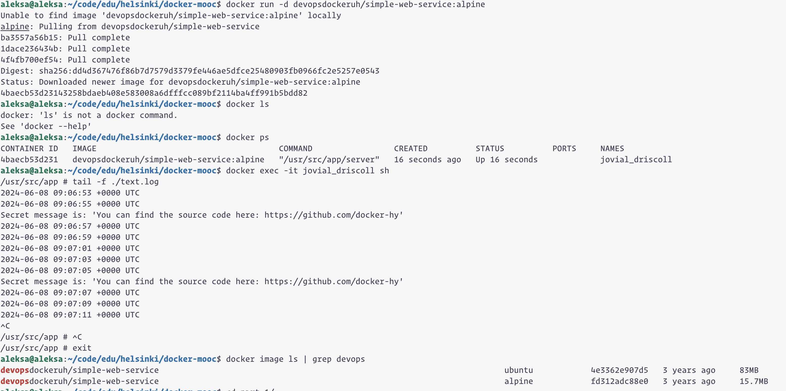

```
aleksa@aleksa:~/code/edu/helsinki/docker-mooc$ docker image ls | grep devops
devopsdockeruh/simple-web-service                                                                        ubuntu            4e3362e907d5   3 years ago     83MB
devopsdockeruh/simple-web-service                                                                        alpine            fd312adc88e0   3 years ago     15.7MB
```

We can see that alpine version is more than 5 times smaller in size (15.7MB compared to 83MB).


```
aleksa@aleksa:~/code/edu/helsinki/docker-mooc$ docker run -d devopsdockeruh/simple-web-service:alpine
Unable to find image 'devopsdockeruh/simple-web-service:alpine' locally
alpine: Pulling from devopsdockeruh/simple-web-service
ba3557a56b15: Pull complete 
1dace236434b: Pull complete 
4f4fb700ef54: Pull complete 
Digest: sha256:dd4d367476f86b7d7579d3379fe446ae5dfce25480903fb0966fc2e5257e0543
Status: Downloaded newer image for devopsdockeruh/simple-web-service:alpine
4baecb53d23143258bdaeb408e583008a6dfffcc089bf2114ba4ff991b5bdd82
aleksa@aleksa:~/code/edu/helsinki/docker-mooc$ docker ps
CONTAINER ID   IMAGE                                      COMMAND                 CREATED          STATUS          PORTS     NAMES
4baecb53d231   devopsdockeruh/simple-web-service:alpine   "/usr/src/app/server"   16 seconds ago   Up 16 seconds             jovial_driscoll
aleksa@aleksa:~/code/edu/helsinki/docker-mooc$ docker exec -it jovial_driscoll sh
/usr/src/app # tail -f ./text.log 
2024-06-08 09:06:53 +0000 UTC
2024-06-08 09:06:55 +0000 UTC
Secret message is: 'You can find the source code here: https://github.com/docker-hy'
```

