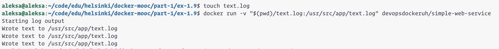

Sample of `text.log`
```
2024-06-08 11:46:05 +0000 UTC
2024-06-08 11:46:07 +0000 UTC
2024-06-08 11:46:09 +0000 UTC
```

```
aleksa@aleksa:~/code/edu/helsinki/docker-mooc/part-1/ex-1.9$ touch text.log
aleksa@aleksa:~/code/edu/helsinki/docker-mooc/part-1/ex-1.9$ docker run -v "$(pwd)/text.log:/usr/src/app/text.log" devopsdockeruh/simple-web-service
Starting log output
Wrote text to /usr/src/app/text.log
Wrote text to /usr/src/app/text.log
Wrote text to /usr/src/app/text.log
```

