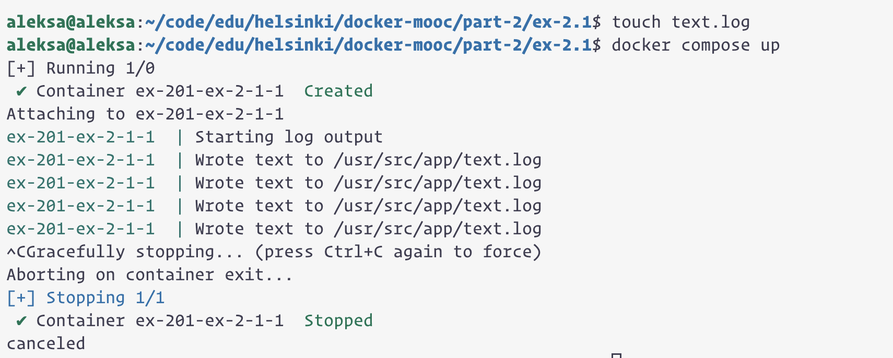

```
aleksa@aleksa:~/code/edu/helsinki/docker-mooc/part-2/ex-2.01$ touch text.log
aleksa@aleksa:~/code/edu/helsinki/docker-mooc/part-2/ex-2.01$ docker compose up
[+] Running 1/0
 ✔ Container ex-201-ex-2-1-1  Created                                                                                                                                              0.0s 
Attaching to ex-201-ex-2-1-1
ex-201-ex-2-1-1  | Starting log output
ex-201-ex-2-1-1  | Wrote text to /usr/src/app/text.log
ex-201-ex-2-1-1  | Wrote text to /usr/src/app/text.log
ex-201-ex-2-1-1  | Wrote text to /usr/src/app/text.log
ex-201-ex-2-1-1  | Wrote text to /usr/src/app/text.log
^CGracefully stopping... (press Ctrl+C again to force)
Aborting on container exit...
[+] Stopping 1/1
 ✔ Container ex-201-ex-2-1-1  Stopped                                                                                                                                              0.3s 
canceled
```

