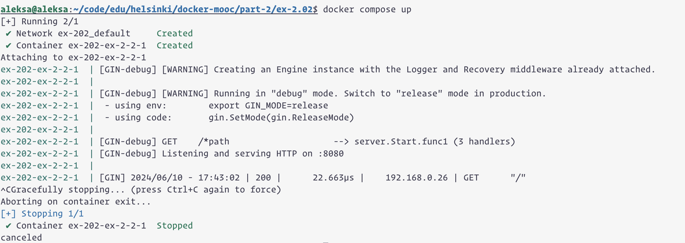
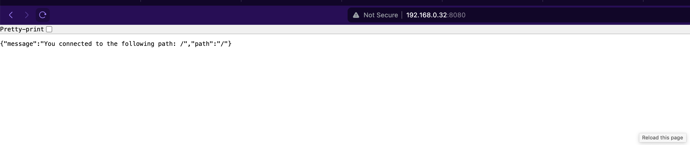

```
aleksa@aleksa:~/code/edu/helsinki/docker-mooc/part-2/ex-2.02$ docker compose up
[+] Running 2/1
 ✔ Network ex-202_default     Created                                                                                                                                              0.1s 
 ✔ Container ex-202-ex-2-2-1  Created                                                                                                                                              0.0s 
Attaching to ex-202-ex-2-2-1
ex-202-ex-2-2-1  | [GIN-debug] [WARNING] Creating an Engine instance with the Logger and Recovery middleware already attached.
ex-202-ex-2-2-1  | 
ex-202-ex-2-2-1  | [GIN-debug] [WARNING] Running in "debug" mode. Switch to "release" mode in production.
ex-202-ex-2-2-1  |  - using env:        export GIN_MODE=release
ex-202-ex-2-2-1  |  - using code:       gin.SetMode(gin.ReleaseMode)
ex-202-ex-2-2-1  | 
ex-202-ex-2-2-1  | [GIN-debug] GET    /*path                    --> server.Start.func1 (3 handlers)
ex-202-ex-2-2-1  | [GIN-debug] Listening and serving HTTP on :8080
ex-202-ex-2-2-1  | 
ex-202-ex-2-2-1  | [GIN] 2024/06/10 - 17:43:02 | 200 |      22.663µs |    192.168.0.26 | GET      "/"
^CGracefully stopping... (press Ctrl+C again to force)
Aborting on container exit...
[+] Stopping 1/1
 ✔ Container ex-202-ex-2-2-1  Stopped                                                                                                                                              0.3s 
canceled
```


