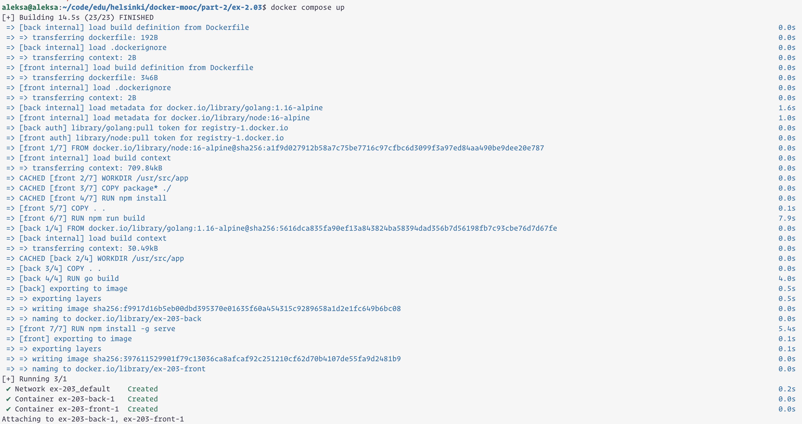
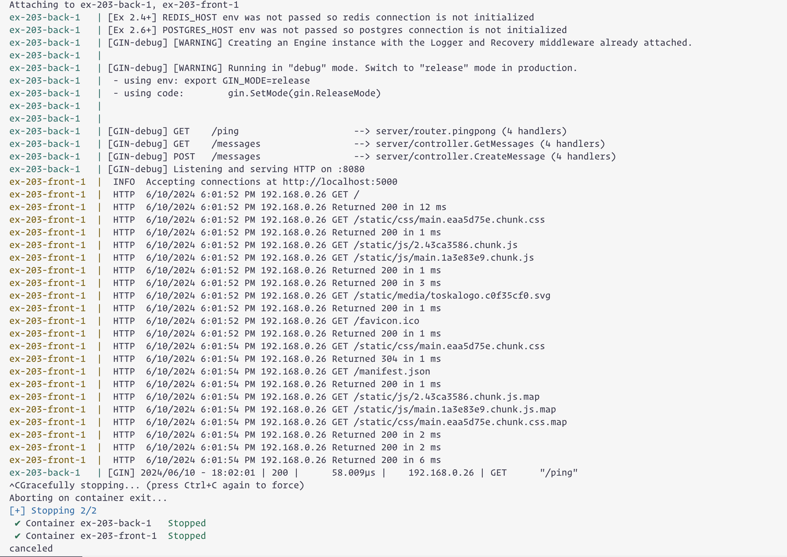
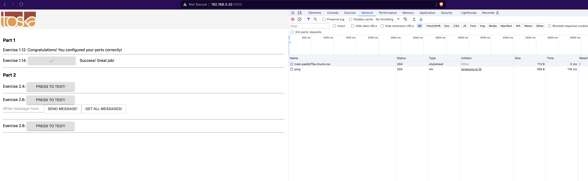

```
aleksa@aleksa:~/code/edu/helsinki/docker-mooc/part-2/ex-2.03$ docker compose up
[+] Building 14.5s (23/23) FINISHED                                                                                                                                                     
 => [back internal] load build definition from Dockerfile                                                                                                                          0.0s
 => => transferring dockerfile: 192B                                                                                                                                               0.0s
 => [back internal] load .dockerignore                                                                                                                                             0.0s
 => => transferring context: 2B                                                                                                                                                    0.0s
 => [front internal] load build definition from Dockerfile                                                                                                                         0.0s
 => => transferring dockerfile: 346B                                                                                                                                               0.0s
 => [front internal] load .dockerignore                                                                                                                                            0.0s
 => => transferring context: 2B                                                                                                                                                    0.0s
 => [back internal] load metadata for docker.io/library/golang:1.16-alpine                                                                                                         1.6s
 => [front internal] load metadata for docker.io/library/node:16-alpine                                                                                                            1.0s
 => [back auth] library/golang:pull token for registry-1.docker.io                                                                                                                 0.0s
 => [front auth] library/node:pull token for registry-1.docker.io                                                                                                                  0.0s
 => [front 1/7] FROM docker.io/library/node:16-alpine@sha256:a1f9d027912b58a7c75be7716c97cfbc6d3099f3a97ed84aa490be9dee20e787                                                      0.0s
 => [front internal] load build context                                                                                                                                            0.0s
 => => transferring context: 709.84kB                                                                                                                                              0.0s
 => CACHED [front 2/7] WORKDIR /usr/src/app                                                                                                                                        0.0s
 => CACHED [front 3/7] COPY package* ./                                                                                                                                            0.0s
 => CACHED [front 4/7] RUN npm install                                                                                                                                             0.0s
 => [front 5/7] COPY . .                                                                                                                                                           0.1s
 => [front 6/7] RUN npm run build                                                                                                                                                  7.9s
 => [back 1/4] FROM docker.io/library/golang:1.16-alpine@sha256:5616dca835fa90ef13a843824ba58394dad356b7d56198fb7c93cbe76d7d67fe                                                   0.0s
 => [back internal] load build context                                                                                                                                             0.0s
 => => transferring context: 30.49kB                                                                                                                                               0.0s
 => CACHED [back 2/4] WORKDIR /usr/src/app                                                                                                                                         0.0s
 => [back 3/4] COPY . .                                                                                                                                                            0.0s
 => [back 4/4] RUN go build                                                                                                                                                        4.0s
 => [back] exporting to image                                                                                                                                                      0.5s
 => => exporting layers                                                                                                                                                            0.5s
 => => writing image sha256:f9917d16b5eb00dbd395370e01635f60a454315c9289658a1d2e1fc649b6bc08                                                                                       0.0s
 => => naming to docker.io/library/ex-203-back                                                                                                                                     0.0s
 => [front 7/7] RUN npm install -g serve                                                                                                                                           5.4s
 => [front] exporting to image                                                                                                                                                     0.1s
 => => exporting layers                                                                                                                                                            0.1s
 => => writing image sha256:397611529901f79c13036ca8afcaf92c251210cf62d70b4107de55fa9d2481b9                                                                                       0.0s
 => => naming to docker.io/library/ex-203-front                                                                                                                                    0.0s
[+] Running 3/1
 ✔ Network ex-203_default    Created                                                                                                                                               0.2s 
 ✔ Container ex-203-back-1   Created                                                                                                                                               0.0s 
 ✔ Container ex-203-front-1  Created                                                                                                                                               0.0s 
Attaching to ex-203-back-1, ex-203-front-1
ex-203-back-1   | [Ex 2.4+] REDIS_HOST env was not passed so redis connection is not initialized
ex-203-back-1   | [Ex 2.6+] POSTGRES_HOST env was not passed so postgres connection is not initialized
ex-203-back-1   | [GIN-debug] [WARNING] Creating an Engine instance with the Logger and Recovery middleware already attached.
ex-203-back-1   | 
ex-203-back-1   | [GIN-debug] [WARNING] Running in "debug" mode. Switch to "release" mode in production.
ex-203-back-1   |  - using env: export GIN_MODE=release
ex-203-back-1   |  - using code:        gin.SetMode(gin.ReleaseMode)
ex-203-back-1   | 
ex-203-back-1   | 
ex-203-back-1   | [GIN-debug] GET    /ping                     --> server/router.pingpong (4 handlers)
ex-203-back-1   | [GIN-debug] GET    /messages                 --> server/controller.GetMessages (4 handlers)
ex-203-back-1   | [GIN-debug] POST   /messages                 --> server/controller.CreateMessage (4 handlers)
ex-203-back-1   | [GIN-debug] Listening and serving HTTP on :8080
ex-203-front-1  |  INFO  Accepting connections at http://localhost:5000
ex-203-front-1  |  HTTP  6/10/2024 6:01:52 PM 192.168.0.26 GET /
ex-203-front-1  |  HTTP  6/10/2024 6:01:52 PM 192.168.0.26 Returned 200 in 12 ms
ex-203-front-1  |  HTTP  6/10/2024 6:01:52 PM 192.168.0.26 GET /static/css/main.eaa5d75e.chunk.css
ex-203-front-1  |  HTTP  6/10/2024 6:01:52 PM 192.168.0.26 Returned 200 in 1 ms
ex-203-front-1  |  HTTP  6/10/2024 6:01:52 PM 192.168.0.26 GET /static/js/2.43ca3586.chunk.js
ex-203-front-1  |  HTTP  6/10/2024 6:01:52 PM 192.168.0.26 GET /static/js/main.1a3e83e9.chunk.js
ex-203-front-1  |  HTTP  6/10/2024 6:01:52 PM 192.168.0.26 Returned 200 in 1 ms
ex-203-front-1  |  HTTP  6/10/2024 6:01:52 PM 192.168.0.26 Returned 200 in 3 ms
ex-203-front-1  |  HTTP  6/10/2024 6:01:52 PM 192.168.0.26 GET /static/media/toskalogo.c0f35cf0.svg
ex-203-front-1  |  HTTP  6/10/2024 6:01:52 PM 192.168.0.26 Returned 200 in 1 ms
ex-203-front-1  |  HTTP  6/10/2024 6:01:52 PM 192.168.0.26 GET /favicon.ico
ex-203-front-1  |  HTTP  6/10/2024 6:01:52 PM 192.168.0.26 Returned 200 in 1 ms
ex-203-front-1  |  HTTP  6/10/2024 6:01:54 PM 192.168.0.26 GET /static/css/main.eaa5d75e.chunk.css
ex-203-front-1  |  HTTP  6/10/2024 6:01:54 PM 192.168.0.26 Returned 304 in 1 ms
ex-203-front-1  |  HTTP  6/10/2024 6:01:54 PM 192.168.0.26 GET /manifest.json
ex-203-front-1  |  HTTP  6/10/2024 6:01:54 PM 192.168.0.26 Returned 200 in 1 ms
ex-203-front-1  |  HTTP  6/10/2024 6:01:54 PM 192.168.0.26 GET /static/js/2.43ca3586.chunk.js.map
ex-203-front-1  |  HTTP  6/10/2024 6:01:54 PM 192.168.0.26 GET /static/js/main.1a3e83e9.chunk.js.map
ex-203-front-1  |  HTTP  6/10/2024 6:01:54 PM 192.168.0.26 GET /static/css/main.eaa5d75e.chunk.css.map
ex-203-front-1  |  HTTP  6/10/2024 6:01:54 PM 192.168.0.26 Returned 200 in 2 ms
ex-203-front-1  |  HTTP  6/10/2024 6:01:54 PM 192.168.0.26 Returned 200 in 2 ms
ex-203-front-1  |  HTTP  6/10/2024 6:01:54 PM 192.168.0.26 Returned 200 in 6 ms
ex-203-back-1   | [GIN] 2024/06/10 - 18:02:01 | 200 |      58.009µs |    192.168.0.26 | GET      "/ping"
^CGracefully stopping... (press Ctrl+C again to force)
Aborting on container exit...
[+] Stopping 2/2
 ✔ Container ex-203-back-1   Stopped                                                                                                                                               0.5s 
 ✔ Container ex-203-front-1  Stopped                                                                                                                                               0.4s 
canceled
```



