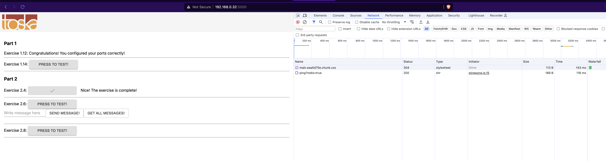
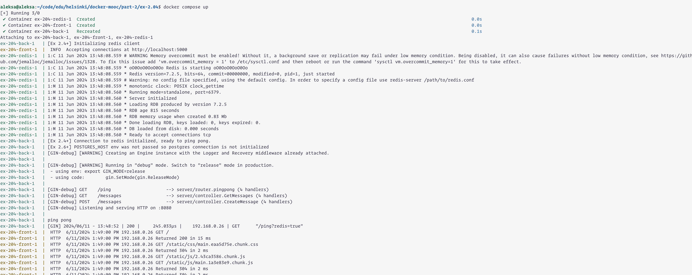

```
aleksa@aleksa:~/code/edu/helsinki/docker-mooc/part-2/ex-2.04$ docker compose up
[+] Running 3/0
 ✔ Container ex-204-redis-1  Created                                                                                                                                               0.0s 
 ✔ Container ex-204-front-1  Created                                                                                                                                               0.0s 
 ✔ Container ex-204-back-1   Recreated                                                                                                                                             0.1s 
Attaching to ex-204-back-1, ex-204-front-1, ex-204-redis-1
ex-204-back-1   | [Ex 2.4+] Initializing redis client
ex-204-front-1  |  INFO  Accepting connections at http://localhost:5000
ex-204-redis-1  | 1:C 11 Jun 2024 13:48:08.559 # WARNING Memory overcommit must be enabled! Without it, a background save or replication may fail under low memory condition. Being disabled, it can also cause failures without low memory condition, see https://github.com/jemalloc/jemalloc/issues/1328. To fix this issue add 'vm.overcommit_memory = 1' to /etc/sysctl.conf and then reboot or run the command 'sysctl vm.overcommit_memory=1' for this to take effect.
ex-204-redis-1  | 1:C 11 Jun 2024 13:48:08.559 * oO0OoO0OoO0Oo Redis is starting oO0OoO0OoO0Oo
ex-204-redis-1  | 1:C 11 Jun 2024 13:48:08.559 * Redis version=7.2.5, bits=64, commit=00000000, modified=0, pid=1, just started
ex-204-redis-1  | 1:C 11 Jun 2024 13:48:08.559 # Warning: no config file specified, using the default config. In order to specify a config file use redis-server /path/to/redis.conf
ex-204-redis-1  | 1:M 11 Jun 2024 13:48:08.559 * monotonic clock: POSIX clock_gettime
ex-204-redis-1  | 1:M 11 Jun 2024 13:48:08.560 * Running mode=standalone, port=6379.
ex-204-redis-1  | 1:M 11 Jun 2024 13:48:08.560 * Server initialized
ex-204-redis-1  | 1:M 11 Jun 2024 13:48:08.560 * Loading RDB produced by version 7.2.5
ex-204-redis-1  | 1:M 11 Jun 2024 13:48:08.560 * RDB age 815 seconds
ex-204-redis-1  | 1:M 11 Jun 2024 13:48:08.560 * RDB memory usage when created 0.83 Mb
ex-204-redis-1  | 1:M 11 Jun 2024 13:48:08.560 * Done loading RDB, keys loaded: 0, keys expired: 0.
ex-204-redis-1  | 1:M 11 Jun 2024 13:48:08.560 * DB loaded from disk: 0.000 seconds
ex-204-redis-1  | 1:M 11 Jun 2024 13:48:08.560 * Ready to accept connections tcp
ex-204-back-1   | [Ex 2.4+] Connection to redis initialized, ready to ping pong.
ex-204-back-1   | [Ex 2.6+] POSTGRES_HOST env was not passed so postgres connection is not initialized
ex-204-back-1   | [GIN-debug] [WARNING] Creating an Engine instance with the Logger and Recovery middleware already attached.
ex-204-back-1   | 
ex-204-back-1   | [GIN-debug] [WARNING] Running in "debug" mode. Switch to "release" mode in production.
ex-204-back-1   |  - using env: export GIN_MODE=release
ex-204-back-1   |  - using code:        gin.SetMode(gin.ReleaseMode)
ex-204-back-1   | 
ex-204-back-1   | [GIN-debug] GET    /ping                     --> server/router.pingpong (4 handlers)
ex-204-back-1   | [GIN-debug] GET    /messages                 --> server/controller.GetMessages (4 handlers)
ex-204-back-1   | [GIN-debug] POST   /messages                 --> server/controller.CreateMessage (4 handlers)
ex-204-back-1   | [GIN-debug] Listening and serving HTTP on :8080
ex-204-back-1   | 
ex-204-back-1   | ping pong
ex-204-back-1   | [GIN] 2024/06/11 - 13:48:52 | 200 |     245.033µs |    192.168.0.26 | GET      "/ping?redis=true"
ex-204-front-1  |  HTTP  6/11/2024 1:49:00 PM 192.168.0.26 GET /
ex-204-front-1  |  HTTP  6/11/2024 1:49:00 PM 192.168.0.26 Returned 200 in 15 ms
ex-204-front-1  |  HTTP  6/11/2024 1:49:00 PM 192.168.0.26 GET /static/css/main.eaa5d75e.chunk.css
ex-204-front-1  |  HTTP  6/11/2024 1:49:00 PM 192.168.0.26 Returned 304 in 2 ms
ex-204-front-1  |  HTTP  6/11/2024 1:49:00 PM 192.168.0.26 GET /static/js/2.43ca3586.chunk.js
ex-204-front-1  |  HTTP  6/11/2024 1:49:00 PM 192.168.0.26 GET /static/js/main.1a3e83e9.chunk.js
ex-204-front-1  |  HTTP  6/11/2024 1:49:00 PM 192.168.0.26 Returned 304 in 2 ms
ex-204-front-1  |  HTTP  6/11/2024 1:49:00 PM 192.168.0.26 Returned 304 in 2 ms
ex-204-front-1  |  HTTP  6/11/2024 1:49:00 PM 192.168.0.26 GET /static/media/toskalogo.c0f35cf0.svg
ex-204-front-1  |  HTTP  6/11/2024 1:49:00 PM 192.168.0.26 Returned 304 in 2 ms
ex-204-front-1  |  HTTP  6/11/2024 1:49:00 PM 192.168.0.26 GET /favicon.ico
ex-204-front-1  |  HTTP  6/11/2024 1:49:00 PM 192.168.0.26 Returned 304 in 1 ms
ex-204-front-1  |  HTTP  6/11/2024 1:49:03 PM 192.168.0.26 GET /static/css/main.eaa5d75e.chunk.css
ex-204-front-1  |  HTTP  6/11/2024 1:49:03 PM 192.168.0.26 GET /static/js/2.43ca3586.chunk.js.map
ex-204-front-1  |  HTTP  6/11/2024 1:49:03 PM 192.168.0.26 GET /static/js/main.1a3e83e9.chunk.js.map
ex-204-front-1  |  HTTP  6/11/2024 1:49:03 PM 192.168.0.26 Returned 304 in 2 ms
ex-204-front-1  |  HTTP  6/11/2024 1:49:03 PM 192.168.0.26 GET /manifest.json
ex-204-front-1  |  HTTP  6/11/2024 1:49:03 PM 192.168.0.26 Returned 200 in 3 ms
ex-204-front-1  |  HTTP  6/11/2024 1:49:03 PM 192.168.0.26 Returned 200 in 2 ms
ex-204-front-1  |  HTTP  6/11/2024 1:49:03 PM 192.168.0.26 Returned 200 in 6 ms
ex-204-front-1  |  HTTP  6/11/2024 1:49:03 PM 192.168.0.26 GET /static/css/main.eaa5d75e.chunk.css.map
ex-204-front-1  |  HTTP  6/11/2024 1:49:03 PM 192.168.0.26 Returned 200 in 0 ms
ex-204-back-1   | ping pong
ex-204-back-1   | [GIN] 2024/06/11 - 13:49:06 | 200 |     215.127µs |    192.168.0.26 | GET      "/ping?redis=true"
^CGracefully stopping... (press Ctrl+C again to force)
Aborting on container exit...
[+] Stopping 3/3
 ✔ Container ex-204-redis-1  Stopped                                                                                                                                                       0.4s 
 ✔ Container ex-204-front-1  Stopped                                                                                                                                                       0.6s 
 ✔ Container ex-204-back-1   Stopped                                                                                                                                                       0.4s 
canceled
```


