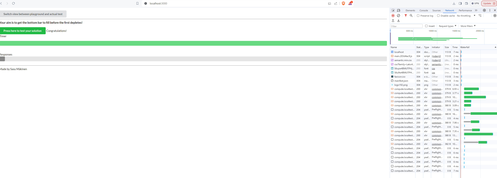
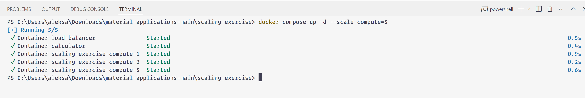

```
PS C:\Users\aleksa\Downloads\material-applications-main\scaling-exercise> docker compose up -d --scale compute=3 
[+] Running 5/5
 ✔ Container load-balancer               Started                                                                                                                     0.5s 
 ✔ Container calculator                  Started                                                                                                                     0.4s 
 ✔ Container scaling-exercise-compute-1  Started                                                                                                                     0.9s 
 ✔ Container scaling-exercise-compute-2  Started                                                                                                                     0.2s 
 ✔ Container scaling-exercise-compute-3  Started                                                                                                                     0.6s 
```


