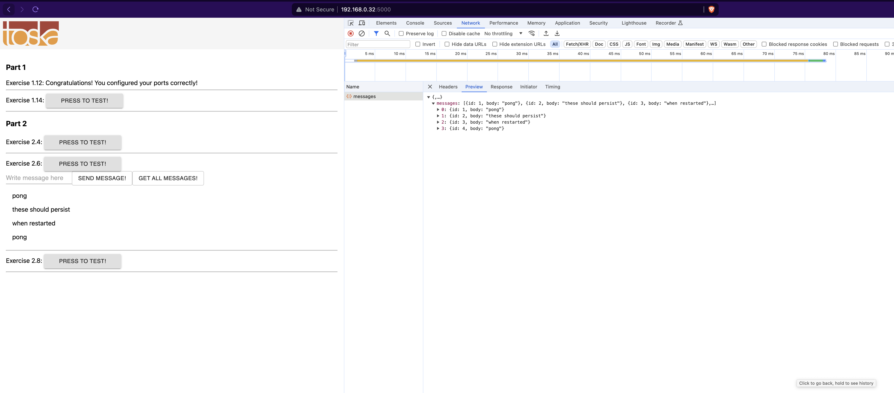

```
aleksa@aleksa:~/code/edu/helsinki/docker-mooc/part-2/ex-2.07$ docker compose up
[+] Running 4/0
 ✔ Container ex-207-front-1  Created                                                                                      0.0s 
 ✔ Container ex-207-redis-1  Created                                                                                      0.0s 
 ✔ Container ex-207-db-1     Created                                                                                      0.0s 
 ✔ Container ex-207-back-1   Created                                                                                      0.0s 
Attaching to ex-207-back-1, ex-207-db-1, ex-207-front-1, ex-207-redis-1
ex-207-redis-1  | 1:C 11 Jun 2024 19:16:38.859 # WARNING Memory overcommit must be enabled! Without it, a background save or replication may fail under low memory condition. Being disabled, it can also cause failures without low memory condition, see https://github.com/jemalloc/jemalloc/issues/1328. To fix this issue add 'vm.overcommit_memory = 1' to /etc/sysctl.conf and then reboot or run the command 'sysctl vm.overcommit_memory=1' for this to take effect.
ex-207-redis-1  | 1:C 11 Jun 2024 19:16:38.859 * oO0OoO0OoO0Oo Redis is starting oO0OoO0OoO0Oo
ex-207-redis-1  | 1:C 11 Jun 2024 19:16:38.859 * Redis version=7.2.5, bits=64, commit=00000000, modified=0, pid=1, just started
ex-207-redis-1  | 1:C 11 Jun 2024 19:16:38.859 # Warning: no config file specified, using the default config. In order to specify a config file use redis-server /path/to/redis.conf
ex-207-redis-1  | 1:M 11 Jun 2024 19:16:38.860 * monotonic clock: POSIX clock_gettime
ex-207-redis-1  | 1:M 11 Jun 2024 19:16:38.860 * Running mode=standalone, port=6379.
ex-207-redis-1  | 1:M 11 Jun 2024 19:16:38.860 * Server initialized
ex-207-redis-1  | 1:M 11 Jun 2024 19:16:38.860 * Loading RDB produced by version 7.2.5
ex-207-redis-1  | 1:M 11 Jun 2024 19:16:38.860 * RDB age 7 seconds
ex-207-redis-1  | 1:M 11 Jun 2024 19:16:38.860 * RDB memory usage when created 0.85 Mb
ex-207-redis-1  | 1:M 11 Jun 2024 19:16:38.860 * Done loading RDB, keys loaded: 1, keys expired: 0.
ex-207-redis-1  | 1:M 11 Jun 2024 19:16:38.860 * DB loaded from disk: 0.000 seconds
ex-207-redis-1  | 1:M 11 Jun 2024 19:16:38.860 * Ready to accept connections tcp
ex-207-db-1     | 
ex-207-db-1     | PostgreSQL Database directory appears to contain a database; Skipping initialization
ex-207-db-1     | 
ex-207-db-1     | 
ex-207-db-1     | 2024-06-11 19:16:39.065 UTC [1] LOG:  starting PostgreSQL 16.3 (Debian 16.3-1.pgdg120+1) on x86_64-pc-linux-gnu, compiled by gcc (Debian 12.2.0-14) 12.2.0, 64-bit
ex-207-db-1     | 2024-06-11 19:16:39.065 UTC [1] LOG:  listening on IPv4 address "0.0.0.0", port 5432
ex-207-db-1     | 2024-06-11 19:16:39.065 UTC [1] LOG:  listening on IPv6 address "::", port 5432
ex-207-db-1     | 2024-06-11 19:16:39.066 UTC [1] LOG:  listening on Unix socket "/var/run/postgresql/.s.PGSQL.5432"
ex-207-db-1     | 2024-06-11 19:16:39.067 UTC [29] LOG:  database system was shut down at 2024-06-11 19:16:32 UTC
ex-207-db-1     | 2024-06-11 19:16:39.069 UTC [1] LOG:  database system is ready to accept connections
ex-207-front-1  |  INFO  Accepting connections at http://localhost:5000
ex-207-back-1   | [Ex 2.4+] Initializing redis client
ex-207-back-1   | [Ex 2.4+] Connection to redis initialized, ready to ping pong.
ex-207-back-1   | [Ex 2.6+] Initializing postgres connection with envs
ex-207-back-1   |               POSTGRES_HOST      db,
ex-207-back-1   |               POSTGRES_USER:     postgres,
ex-207-back-1   |               POSTGRES_PASSWORD: postgres,
ex-207-back-1   |               POSTGRES_DATABASE: postgres
ex-207-back-1   |               to db:5432
ex-207-db-1     | 2024-06-11 19:16:39.241 UTC [33] ERROR:  relation "messages" already exists
ex-207-db-1     | 2024-06-11 19:16:39.241 UTC [33] STATEMENT:  CREATE TABLE "messages" ("id" bigserial, "body" text, PRIMARY KEY ("id"))
ex-207-back-1   | [Ex 2.6+] Connection to postgres initialized, ready to ping pong.
ex-207-back-1   | [GIN-debug] [WARNING] Creating an Engine instance with the Logger and Recovery middleware already attached.
ex-207-back-1   | 
ex-207-back-1   | [GIN-debug] [WARNING] Running in "debug" mode. Switch to "release" mode in production.
ex-207-back-1   |  - using env: export GIN_MODE=release
ex-207-back-1   |  - using code:        gin.SetMode(gin.ReleaseMode)
ex-207-back-1   | 
ex-207-back-1   | 
ex-207-back-1   | [GIN-debug] GET    /ping                     --> server/router.pingpong (4 handlers)
ex-207-back-1   | [GIN-debug] GET    /messages                 --> server/controller.GetMessages (4 handlers)
ex-207-back-1   | [GIN-debug] POST   /messages                 --> server/controller.CreateMessage (4 handlers)
ex-207-back-1   | [GIN-debug] Listening and serving HTTP on :8080
ex-207-front-1  |  HTTP  6/11/2024 7:16:42 PM 192.168.0.26 GET /
ex-207-front-1  |  HTTP  6/11/2024 7:16:42 PM 192.168.0.26 Returned 304 in 7 ms
ex-207-front-1  |  HTTP  6/11/2024 7:16:42 PM 192.168.0.26 GET /static/css/main.eaa5d75e.chunk.css
ex-207-front-1  |  HTTP  6/11/2024 7:16:42 PM 192.168.0.26 Returned 304 in 1 ms
ex-207-front-1  |  HTTP  6/11/2024 7:16:42 PM 192.168.0.26 GET /static/js/2.43ca3586.chunk.js
ex-207-front-1  |  HTTP  6/11/2024 7:16:42 PM 192.168.0.26 GET /static/js/main.1a3e83e9.chunk.js
ex-207-front-1  |  HTTP  6/11/2024 7:16:42 PM 192.168.0.26 Returned 304 in 1 ms
ex-207-front-1  |  HTTP  6/11/2024 7:16:42 PM 192.168.0.26 Returned 304 in 1 ms
ex-207-front-1  |  HTTP  6/11/2024 7:16:42 PM 192.168.0.26 GET /static/css/main.eaa5d75e.chunk.css.map
ex-207-front-1  |  HTTP  6/11/2024 7:16:42 PM 192.168.0.26 Returned 304 in 0 ms
ex-207-front-1  |  HTTP  6/11/2024 7:16:42 PM 192.168.0.26 GET /static/js/2.43ca3586.chunk.js.map
ex-207-front-1  |  HTTP  6/11/2024 7:16:42 PM 192.168.0.26 Returned 304 in 2 ms
ex-207-front-1  |  HTTP  6/11/2024 7:16:42 PM 192.168.0.26 GET /static/media/toskalogo.c0f35cf0.svg
ex-207-front-1  |  HTTP  6/11/2024 7:16:42 PM 192.168.0.26 Returned 304 in 0 ms
ex-207-front-1  |  HTTP  6/11/2024 7:16:42 PM 192.168.0.26 GET /static/js/main.1a3e83e9.chunk.js.map
ex-207-front-1  |  HTTP  6/11/2024 7:16:42 PM 192.168.0.26 Returned 304 in 1 ms
ex-207-front-1  |  HTTP  6/11/2024 7:16:42 PM 192.168.0.26 GET /favicon.ico
ex-207-front-1  |  HTTP  6/11/2024 7:16:42 PM 192.168.0.26 Returned 304 in 1 ms
ex-207-back-1   | [GIN] 2024/06/11 - 19:16:52 | 200 |     789.409µs |    192.168.0.26 | GET      "/messages"
^CGracefully stopping... (press Ctrl+C again to force)
Aborting on container exit...
[+] Stopping 4/4
 ✔ Container ex-207-redis-1  Stopped                                                                                                                                                                                                  0.5s 
 ✔ Container ex-207-front-1  Stopped                                                                                                                                                                                                  0.5s 
 ✔ Container ex-207-back-1   Stopped                                                                                                                                                                                                  0.6s 
 ✔ Container ex-207-db-1     Stopped                                                                                                                                                                                                  0.2s 
canceled
```

