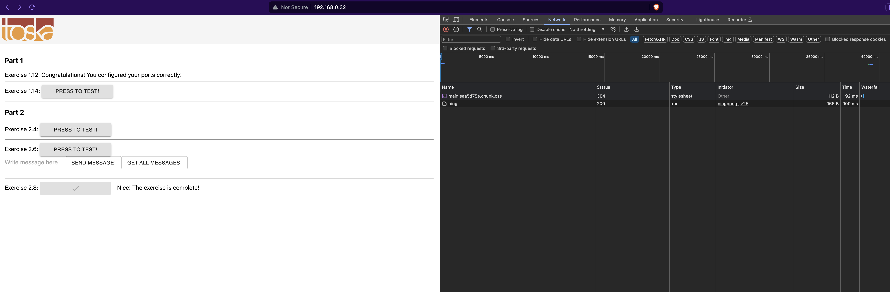
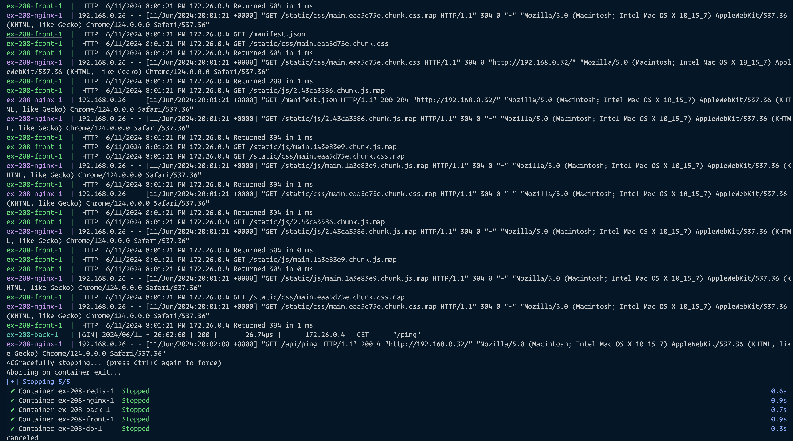

```
aleksa@aleksa:~/code/edu/helsinki/docker-mooc/part-2/ex-2.08$ docker compose up
[+] Running 5/0
 ✔ Container ex-208-front-1  Created                                                                                            0.0s 
 ✔ Container ex-208-redis-1  Created                                                                                            0.0s 
 ✔ Container ex-208-db-1     Created                                                                                            0.0s 
 ✔ Container ex-208-nginx-1  Created                                                                                            0.0s 
 ✔ Container ex-208-back-1   Created                                                                                            0.0s 
Attaching to ex-208-back-1, ex-208-db-1, ex-208-front-1, ex-208-nginx-1, ex-208-redis-1
ex-208-db-1     | 
ex-208-db-1     | PostgreSQL Database directory appears to contain a database; Skipping initialization
ex-208-db-1     | 
ex-208-db-1     | 
ex-208-db-1     | 2024-06-11 20:00:57.752 UTC [1] LOG:  starting PostgreSQL 16.3 (Debian 16.3-1.pgdg120+1) on x86_64-pc-linux-gnu, compiled by gcc (Debian 12.2.0-14) 12.2.0, 64-bit
ex-208-db-1     | 2024-06-11 20:00:57.785 UTC [1] LOG:  listening on IPv4 address "0.0.0.0", port 5432
ex-208-db-1     | 2024-06-11 20:00:57.785 UTC [1] LOG:  listening on IPv6 address "::", port 5432
ex-208-db-1     | 2024-06-11 20:00:57.786 UTC [1] LOG:  listening on Unix socket "/var/run/postgresql/.s.PGSQL.5432"
ex-208-db-1     | 2024-06-11 20:00:57.788 UTC [29] LOG:  database system was shut down at 2024-06-11 19:59:02 UTC
ex-208-db-1     | 2024-06-11 20:00:57.789 UTC [1] LOG:  database system is ready to accept connections
ex-208-nginx-1  | /docker-entrypoint.sh: /docker-entrypoint.d/ is not empty, will attempt to perform configuration
ex-208-nginx-1  | /docker-entrypoint.sh: Looking for shell scripts in /docker-entrypoint.d/
ex-208-nginx-1  | /docker-entrypoint.sh: Launching /docker-entrypoint.d/10-listen-on-ipv6-by-default.sh
ex-208-nginx-1  | 10-listen-on-ipv6-by-default.sh: info: IPv6 listen already enabled
ex-208-nginx-1  | /docker-entrypoint.sh: Sourcing /docker-entrypoint.d/15-local-resolvers.envsh
ex-208-nginx-1  | /docker-entrypoint.sh: Launching /docker-entrypoint.d/20-envsubst-on-templates.sh
ex-208-nginx-1  | /docker-entrypoint.sh: Launching /docker-entrypoint.d/30-tune-worker-processes.sh
ex-208-nginx-1  | /docker-entrypoint.sh: Configuration complete; ready for start up
ex-208-front-1  |  INFO  Accepting connections at http://localhost:5000
ex-208-redis-1  | 1:C 11 Jun 2024 20:00:58.035 # WARNING Memory overcommit must be enabled! Without it, a background save or replication may fail under low memory condition. Being disabled, it can also cause failures without low memory condition, see https://github.com/jemalloc/jemalloc/issues/1328. To fix this issue add 'vm.overcommit_memory = 1' to /etc/sysctl.conf and then reboot or run the command 'sysctl vm.overcommit_memory=1' for this to take effect.
ex-208-redis-1  | 1:C 11 Jun 2024 20:00:58.035 * oO0OoO0OoO0Oo Redis is starting oO0OoO0OoO0Oo
ex-208-redis-1  | 1:C 11 Jun 2024 20:00:58.035 * Redis version=7.2.5, bits=64, commit=00000000, modified=0, pid=1, just started
ex-208-redis-1  | 1:C 11 Jun 2024 20:00:58.035 # Warning: no config file specified, using the default config. In order to specify a config file use redis-server /path/to/redis.conf
ex-208-redis-1  | 1:M 11 Jun 2024 20:00:58.035 * monotonic clock: POSIX clock_gettime
ex-208-redis-1  | 1:M 11 Jun 2024 20:00:58.035 * Running mode=standalone, port=6379.
ex-208-redis-1  | 1:M 11 Jun 2024 20:00:58.035 * Server initialized
ex-208-redis-1  | 1:M 11 Jun 2024 20:00:58.035 * Loading RDB produced by version 7.2.5
ex-208-redis-1  | 1:M 11 Jun 2024 20:00:58.035 * RDB age 116 seconds
ex-208-redis-1  | 1:M 11 Jun 2024 20:00:58.035 * RDB memory usage when created 0.85 Mb
ex-208-redis-1  | 1:M 11 Jun 2024 20:00:58.035 * Done loading RDB, keys loaded: 1, keys expired: 0.
ex-208-redis-1  | 1:M 11 Jun 2024 20:00:58.035 * DB loaded from disk: 0.000 seconds
ex-208-redis-1  | 1:M 11 Jun 2024 20:00:58.035 * Ready to accept connections tcp
ex-208-back-1   | [Ex 2.4+] Initializing redis client
ex-208-back-1   | [Ex 2.4+] Connection to redis initialized, ready to ping pong.
ex-208-back-1   | [Ex 2.6+] Initializing postgres connection with envs
ex-208-back-1   |               POSTGRES_HOST      db,
ex-208-back-1   |               POSTGRES_USER:     postgres,
ex-208-back-1   |               POSTGRES_PASSWORD: postgres,
ex-208-back-1   |               POSTGRES_DATABASE: postgres
ex-208-back-1   |               to db:5432
ex-208-db-1     | 2024-06-11 20:00:58.134 UTC [33] ERROR:  relation "messages" already exists
ex-208-db-1     | 2024-06-11 20:00:58.134 UTC [33] STATEMENT:  CREATE TABLE "messages" ("id" bigserial, "body" text, PRIMARY KEY ("id"))
ex-208-back-1   | [Ex 2.6+] Connection to postgres initialized, ready to ping pong.
ex-208-back-1   | [GIN-debug] [WARNING] Creating an Engine instance with the Logger and Recovery middleware already attached.
ex-208-back-1   | 
ex-208-back-1   | [GIN-debug] [WARNING] Running in "debug" mode. Switch to "release" mode in production.
ex-208-back-1   |  - using env: export GIN_MODE=release
ex-208-back-1   |  - using code:        gin.SetMode(gin.ReleaseMode)
ex-208-back-1   | 
ex-208-back-1   | 
ex-208-back-1   | [GIN-debug] GET    /ping                     --> server/router.pingpong (4 handlers)
ex-208-back-1   | [GIN-debug] GET    /messages                 --> server/controller.GetMessages (4 handlers)
ex-208-back-1   | [GIN-debug] POST   /messages                 --> server/controller.CreateMessage (4 handlers)
ex-208-back-1   | [GIN-debug] Listening and serving HTTP on :8080
ex-208-front-1  |  HTTP  6/11/2024 8:01:12 PM 172.26.0.4 GET /
ex-208-front-1  |  HTTP  6/11/2024 8:01:12 PM 172.26.0.4 Returned 200 in 14 ms
ex-208-nginx-1  | 192.168.0.26 - - [11/Jun/2024:20:01:12 +0000] "GET / HTTP/1.1" 200 1068 "-" "Mozilla/5.0 (Macintosh; Intel Mac OS X 10_15_7) AppleWebKit/537.36 (KHTML, like Gecko) Chrome/124.0.0.0 Safari/537.36"
ex-208-front-1  |  HTTP  6/11/2024 8:01:12 PM 172.26.0.4 GET /static/css/main.eaa5d75e.chunk.css
ex-208-front-1  |  HTTP  6/11/2024 8:01:12 PM 172.26.0.4 Returned 200 in 2 ms
ex-208-nginx-1  | 192.168.0.26 - - [11/Jun/2024:20:01:12 +0000] "GET /static/css/main.eaa5d75e.chunk.css HTTP/1.1" 200 285 "http://192.168.0.32/" "Mozilla/5.0 (Macintosh; Intel Mac OS X 10_15_7) AppleWebKit/537.36 (KHTML, like Gecko) Chrome/124.0.0.0 Safari/537.36"
ex-208-front-1  |  HTTP  6/11/2024 8:01:12 PM 172.26.0.4 GET /static/js/2.43ca3586.chunk.js
ex-208-front-1  |  HTTP  6/11/2024 8:01:12 PM 172.26.0.4 GET /static/js/main.1a3e83e9.chunk.js
ex-208-front-1  |  HTTP  6/11/2024 8:01:12 PM 172.26.0.4 Returned 200 in 1 ms
ex-208-front-1  |  HTTP  6/11/2024 8:01:12 PM 172.26.0.4 Returned 200 in 3 ms
ex-208-nginx-1  | 192.168.0.26 - - [11/Jun/2024:20:01:12 +0000] "GET /static/js/main.1a3e83e9.chunk.js HTTP/1.1" 200 1873 "http://192.168.0.32/" "Mozilla/5.0 (Macintosh; Intel Mac OS X 10_15_7) AppleWebKit/537.36 (KHTML, like Gecko) Chrome/124.0.0.0 Safari/537.36"
ex-208-front-1  |  HTTP  6/11/2024 8:01:12 PM 172.26.0.4 GET /static/css/main.eaa5d75e.chunk.css.map
ex-208-front-1  |  HTTP  6/11/2024 8:01:12 PM 172.26.0.4 Returned 200 in 1 ms
ex-208-nginx-1  | 192.168.0.26 - - [11/Jun/2024:20:01:12 +0000] "GET /static/css/main.eaa5d75e.chunk.css.map HTTP/1.1" 200 518 "-" "Mozilla/5.0 (Macintosh; Intel Mac OS X 10_15_7) AppleWebKit/537.36 (KHTML, like Gecko) Chrome/124.0.0.0 Safari/537.36"
ex-208-nginx-1  | 192.168.0.26 - - [11/Jun/2024:20:01:12 +0000] "GET /static/js/2.43ca3586.chunk.js HTTP/1.1" 200 79372 "http://192.168.0.32/" "Mozilla/5.0 (Macintosh; Intel Mac OS X 10_15_7) AppleWebKit/537.36 (KHTML, like Gecko) Chrome/124.0.0.0 Safari/537.36"
ex-208-front-1  |  HTTP  6/11/2024 8:01:12 PM 172.26.0.4 GET /static/js/2.43ca3586.chunk.js.map
ex-208-front-1  |  HTTP  6/11/2024 8:01:12 PM 172.26.0.4 Returned 200 in 3 ms
ex-208-front-1  |  HTTP  6/11/2024 8:01:12 PM 172.26.0.4 GET /static/media/toskalogo.c0f35cf0.svg
ex-208-front-1  |  HTTP  6/11/2024 8:01:12 PM 172.26.0.4 GET /static/js/main.1a3e83e9.chunk.js.map
ex-208-front-1  |  HTTP  6/11/2024 8:01:12 PM 172.26.0.4 Returned 200 in 1 ms
ex-208-front-1  |  HTTP  6/11/2024 8:01:12 PM 172.26.0.4 Returned 200 in 2 ms
ex-208-nginx-1  | 192.168.0.26 - - [11/Jun/2024:20:01:12 +0000] "GET /static/media/toskalogo.c0f35cf0.svg HTTP/1.1" 200 1524 "http://192.168.0.32/" "Mozilla/5.0 (Macintosh; Intel Mac OS X 10_15_7) AppleWebKit/537.36 (KHTML, like Gecko) Chrome/124.0.0.0 Safari/537.36"
ex-208-nginx-1  | 192.168.0.26 - - [11/Jun/2024:20:01:12 +0000] "GET /static/js/main.1a3e83e9.chunk.js.map HTTP/1.1" 200 3796 "-" "Mozilla/5.0 (Macintosh; Intel Mac OS X 10_15_7) AppleWebKit/537.36 (KHTML, like Gecko) Chrome/124.0.0.0 Safari/537.36"
ex-208-front-1  |  HTTP  6/11/2024 8:01:12 PM 172.26.0.4 GET /favicon.ico
ex-208-front-1  |  HTTP  6/11/2024 8:01:12 PM 172.26.0.4 Returned 200 in 1 ms
ex-208-nginx-1  | 192.168.0.26 - - [11/Jun/2024:20:01:12 +0000] "GET /favicon.ico HTTP/1.1" 200 1068 "http://192.168.0.32/" "Mozilla/5.0 (Macintosh; Intel Mac OS X 10_15_7) AppleWebKit/537.36 (KHTML, like Gecko) Chrome/124.0.0.0 Safari/537.36"
ex-208-nginx-1  | 192.168.0.26 - - [11/Jun/2024:20:01:12 +0000] "GET /static/js/2.43ca3586.chunk.js.map HTTP/1.1" 200 257461 "-" "Mozilla/5.0 (Macintosh; Intel Mac OS X 10_15_7) AppleWebKit/537.36 (KHTML, like Gecko) Chrome/124.0.0.0 Safari/537.36"
ex-208-back-1   | [GIN] 2024/06/11 - 20:01:19 | 200 |      45.455µs |      172.26.0.4 | GET      "/ping"
ex-208-nginx-1  | 192.168.0.26 - - [11/Jun/2024:20:01:19 +0000] "GET /api/ping HTTP/1.1" 200 4 "-" "Mozilla/5.0 (Macintosh; Intel Mac OS X 10_15_7) AppleWebKit/537.36 (KHTML, like Gecko) Chrome/124.0.0.0 Safari/537.36"
ex-208-front-1  |  HTTP  6/11/2024 8:01:19 PM 172.26.0.4 GET /static/css/main.eaa5d75e.chunk.css.map
ex-208-front-1  |  HTTP  6/11/2024 8:01:19 PM 172.26.0.4 Returned 304 in 0 ms
ex-208-nginx-1  | 192.168.0.26 - - [11/Jun/2024:20:01:19 +0000] "GET /static/css/main.eaa5d75e.chunk.css.map HTTP/1.1" 304 0 "-" "Mozilla/5.0 (Macintosh; Intel Mac OS X 10_15_7) AppleWebKit/537.36 (KHTML, like Gecko) Chrome/124.0.0.0 Safari/537.36"
ex-208-front-1  |  HTTP  6/11/2024 8:01:19 PM 172.26.0.4 GET /favicon.ico
ex-208-front-1  |  HTTP  6/11/2024 8:01:19 PM 172.26.0.4 Returned 304 in 1 ms
ex-208-nginx-1  | 192.168.0.26 - - [11/Jun/2024:20:01:19 +0000] "GET /favicon.ico HTTP/1.1" 304 0 "http://192.168.0.32/api/ping" "Mozilla/5.0 (Macintosh; Intel Mac OS X 10_15_7) AppleWebKit/537.36 (KHTML, like Gecko) Chrome/124.0.0.0 Safari/537.36"
ex-208-front-1  |  HTTP  6/11/2024 8:01:21 PM 172.26.0.4 GET /static/js/2.43ca3586.chunk.js.map
ex-208-front-1  |  HTTP  6/11/2024 8:01:21 PM 172.26.0.4 GET /static/js/main.1a3e83e9.chunk.js.map
ex-208-front-1  |  HTTP  6/11/2024 8:01:21 PM 172.26.0.4 GET /static/css/main.eaa5d75e.chunk.css.map
ex-208-front-1  |  HTTP  6/11/2024 8:01:21 PM 172.26.0.4 Returned 304 in 1 ms
ex-208-nginx-1  | 192.168.0.26 - - [11/Jun/2024:20:01:21 +0000] "GET /static/js/2.43ca3586.chunk.js.map HTTP/1.1" 304 0 "-" "Mozilla/5.0 (Macintosh; Intel Mac OS X 10_15_7) AppleWebKit/537.36 (KHTML, like Gecko) Chrome/124.0.0.0 Safari/537.36"
ex-208-front-1  |  HTTP  6/11/2024 8:01:21 PM 172.26.0.4 Returned 304 in 2 ms
ex-208-nginx-1  | 192.168.0.26 - - [11/Jun/2024:20:01:21 +0000] "GET /static/js/main.1a3e83e9.chunk.js.map HTTP/1.1" 304 0 "-" "Mozilla/5.0 (Macintosh; Intel Mac OS X 10_15_7) AppleWebKit/537.36 (KHTML, like Gecko) Chrome/124.0.0.0 Safari/537.36"
ex-208-front-1  |  HTTP  6/11/2024 8:01:21 PM 172.26.0.4 Returned 304 in 1 ms
ex-208-nginx-1  | 192.168.0.26 - - [11/Jun/2024:20:01:21 +0000] "GET /static/css/main.eaa5d75e.chunk.css.map HTTP/1.1" 304 0 "-" "Mozilla/5.0 (Macintosh; Intel Mac OS X 10_15_7) AppleWebKit/537.36 (KHTML, like Gecko) Chrome/124.0.0.0 Safari/537.36"
ex-208-front-1  |  HTTP  6/11/2024 8:01:21 PM 172.26.0.4 GET /manifest.json
ex-208-front-1  |  HTTP  6/11/2024 8:01:21 PM 172.26.0.4 GET /static/css/main.eaa5d75e.chunk.css
ex-208-front-1  |  HTTP  6/11/2024 8:01:21 PM 172.26.0.4 Returned 304 in 1 ms
ex-208-nginx-1  | 192.168.0.26 - - [11/Jun/2024:20:01:21 +0000] "GET /static/css/main.eaa5d75e.chunk.css HTTP/1.1" 304 0 "http://192.168.0.32/" "Mozilla/5.0 (Macintosh; Intel Mac OS X 10_15_7) AppleWebKit/537.36 (KHTML, like Gecko) Chrome/124.0.0.0 Safari/537.36"
ex-208-front-1  |  HTTP  6/11/2024 8:01:21 PM 172.26.0.4 Returned 200 in 1 ms
ex-208-front-1  |  HTTP  6/11/2024 8:01:21 PM 172.26.0.4 GET /static/js/2.43ca3586.chunk.js.map
ex-208-nginx-1  | 192.168.0.26 - - [11/Jun/2024:20:01:21 +0000] "GET /manifest.json HTTP/1.1" 200 204 "http://192.168.0.32/" "Mozilla/5.0 (Macintosh; Intel Mac OS X 10_15_7) AppleWebKit/537.36 (KHTML, like Gecko) Chrome/124.0.0.0 Safari/537.36"
ex-208-nginx-1  | 192.168.0.26 - - [11/Jun/2024:20:01:21 +0000] "GET /static/js/2.43ca3586.chunk.js.map HTTP/1.1" 304 0 "-" "Mozilla/5.0 (Macintosh; Intel Mac OS X 10_15_7) AppleWebKit/537.36 (KHTML, like Gecko) Chrome/124.0.0.0 Safari/537.36"
ex-208-front-1  |  HTTP  6/11/2024 8:01:21 PM 172.26.0.4 Returned 304 in 1 ms
ex-208-front-1  |  HTTP  6/11/2024 8:01:21 PM 172.26.0.4 GET /static/js/main.1a3e83e9.chunk.js.map
ex-208-front-1  |  HTTP  6/11/2024 8:01:21 PM 172.26.0.4 GET /static/css/main.eaa5d75e.chunk.css.map
ex-208-nginx-1  | 192.168.0.26 - - [11/Jun/2024:20:01:21 +0000] "GET /static/js/main.1a3e83e9.chunk.js.map HTTP/1.1" 304 0 "-" "Mozilla/5.0 (Macintosh; Intel Mac OS X 10_15_7) AppleWebKit/537.36 (KHTML, like Gecko) Chrome/124.0.0.0 Safari/537.36"
ex-208-front-1  |  HTTP  6/11/2024 8:01:21 PM 172.26.0.4 Returned 304 in 1 ms
ex-208-nginx-1  | 192.168.0.26 - - [11/Jun/2024:20:01:21 +0000] "GET /static/css/main.eaa5d75e.chunk.css.map HTTP/1.1" 304 0 "-" "Mozilla/5.0 (Macintosh; Intel Mac OS X 10_15_7) AppleWebKit/537.36 (KHTML, like Gecko) Chrome/124.0.0.0 Safari/537.36"
ex-208-front-1  |  HTTP  6/11/2024 8:01:21 PM 172.26.0.4 Returned 304 in 1 ms
ex-208-front-1  |  HTTP  6/11/2024 8:01:21 PM 172.26.0.4 GET /static/js/2.43ca3586.chunk.js.map
ex-208-nginx-1  | 192.168.0.26 - - [11/Jun/2024:20:01:21 +0000] "GET /static/js/2.43ca3586.chunk.js.map HTTP/1.1" 304 0 "-" "Mozilla/5.0 (Macintosh; Intel Mac OS X 10_15_7) AppleWebKit/537.36 (KHTML, like Gecko) Chrome/124.0.0.0 Safari/537.36"
ex-208-front-1  |  HTTP  6/11/2024 8:01:21 PM 172.26.0.4 Returned 304 in 0 ms
ex-208-front-1  |  HTTP  6/11/2024 8:01:21 PM 172.26.0.4 GET /static/js/main.1a3e83e9.chunk.js.map
ex-208-front-1  |  HTTP  6/11/2024 8:01:21 PM 172.26.0.4 Returned 304 in 0 ms
ex-208-nginx-1  | 192.168.0.26 - - [11/Jun/2024:20:01:21 +0000] "GET /static/js/main.1a3e83e9.chunk.js.map HTTP/1.1" 304 0 "-" "Mozilla/5.0 (Macintosh; Intel Mac OS X 10_15_7) AppleWebKit/537.36 (KHTML, like Gecko) Chrome/124.0.0.0 Safari/537.36"
ex-208-front-1  |  HTTP  6/11/2024 8:01:21 PM 172.26.0.4 GET /static/css/main.eaa5d75e.chunk.css.map
ex-208-nginx-1  | 192.168.0.26 - - [11/Jun/2024:20:01:21 +0000] "GET /static/css/main.eaa5d75e.chunk.css.map HTTP/1.1" 304 0 "-" "Mozilla/5.0 (Macintosh; Intel Mac OS X 10_15_7) AppleWebKit/537.36 (KHTML, like Gecko) Chrome/124.0.0.0 Safari/537.36"
ex-208-front-1  |  HTTP  6/11/2024 8:01:21 PM 172.26.0.4 Returned 304 in 1 ms
ex-208-back-1   | [GIN] 2024/06/11 - 20:02:00 | 200 |       26.74µs |      172.26.0.4 | GET      "/ping"
ex-208-nginx-1  | 192.168.0.26 - - [11/Jun/2024:20:02:00 +0000] "GET /api/ping HTTP/1.1" 200 4 "http://192.168.0.32/" "Mozilla/5.0 (Macintosh; Intel Mac OS X 10_15_7) AppleWebKit/537.36 (KHTML, like Gecko) Chrome/124.0.0.0 Safari/537.36"
^CGracefully stopping... (press Ctrl+C again to force)
Aborting on container exit...
[+] Stopping 5/5
 ✔ Container ex-208-redis-1  Stopped                                                                                                                                                            0.6s 
 ✔ Container ex-208-nginx-1  Stopped                                                                                                                                                            0.9s 
 ✔ Container ex-208-back-1   Stopped                                                                                                                                                            0.7s 
 ✔ Container ex-208-front-1  Stopped                                                                                                                                                            0.9s 
 ✔ Container ex-208-db-1     Stopped                                                                                                                                                            0.3s 
canceled
```


