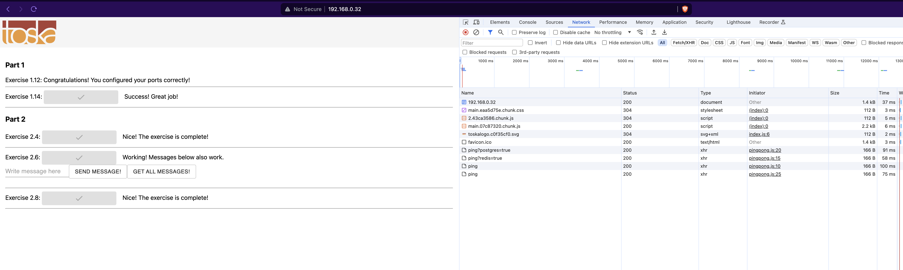

I had to edit `REACT_APP_BACKEND_URL` enviroment variable so that it works with nginx. 

Looking at the network tab of the only button that was working (button for exercise 2.8.) I noticed that everything can work properly if the buttons would send requests to `/api/`. 

I specified a new Dockerfile which should be more flexible with build argument and enviroment variables. This way it will default to `http://back` (as defined in Dockerfile) but if a different argument is specified in `docker-compose.yaml`, compose's argument will overwrite it. 

Then it was a simple case of setting `REACT_APP_BACKEND_URL=/api/` in `docker-compose.yaml`.

