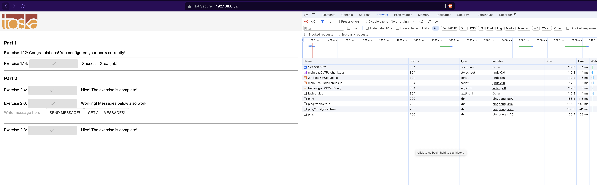
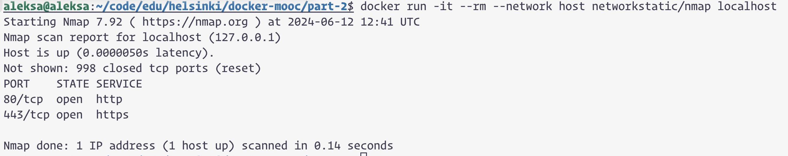

I have removed all ports in `docker-compose.yml` except port 80 which is used by nginx service. 

In the `nginx.conf` I have used compose's service names and default ports for frontend and backend and since all the services run under the same network (thanks to docker compose) everything seems to work. 

For example, I can't access `http://192.168.0.32:8080/` nor `http://192.168.0.32:5000` but `http://192.168.0.32:80` (or just simply `http://192.168.0.32`) works and renders frontend's webpage. 

```
aleksa@aleksa:~/code/edu/helsinki/docker-mooc/part-2$ docker run -it --rm --network host networkstatic/nmap localhost
Starting Nmap 7.92 ( https://nmap.org ) at 2024-06-12 12:41 UTC
Nmap scan report for localhost (127.0.0.1)
Host is up (0.0000050s latency).
Not shown: 998 closed tcp ports (reset)
PORT    STATE SERVICE
80/tcp  open  http
443/tcp open  https

Nmap done: 1 IP address (1 host up) scanned in 0.14 seconds
```


