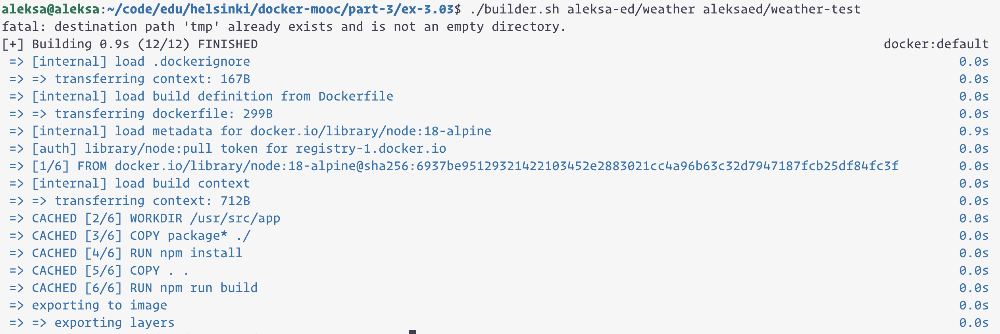

```
aleksa@aleksa:~/code/edu/helsinki/docker-mooc/part-3/ex-3.03$ ./builder.sh aleksa-ed/weather aleksaed/weather-test
fatal: destination path 'tmp' already exists and is not an empty directory.
[+] Building 0.9s (12/12) FINISHED                                                                                   docker:default
 => [internal] load .dockerignore                                                                                              0.0s
 => => transferring context: 167B                                                                                              0.0s
 => [internal] load build definition from Dockerfile                                                                           0.0s
 => => transferring dockerfile: 299B                                                                                           0.0s
 => [internal] load metadata for docker.io/library/node:18-alpine                                                              0.9s
 => [auth] library/node:pull token for registry-1.docker.io                                                                    0.0s
 => [1/6] FROM docker.io/library/node:18-alpine@sha256:6937be95129321422103452e2883021cc4a96b63c32d7947187fcb25df84fc3f        0.0s
 => [internal] load build context                                                                                              0.0s
 => => transferring context: 712B                                                                                              0.0s
 => CACHED [2/6] WORKDIR /usr/src/app                                                                                          0.0s
 => CACHED [3/6] COPY package* ./                                                                                              0.0s
 => CACHED [4/6] RUN npm install                                                                                               0.0s
 => CACHED [5/6] COPY . .                                                                                                      0.0s
 => CACHED [6/6] RUN npm run build                                                                                             0.0s
 => exporting to image                                                                                                         0.0s
 => => exporting layers 
 ```

 